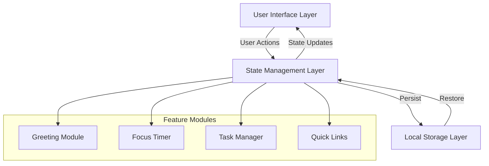
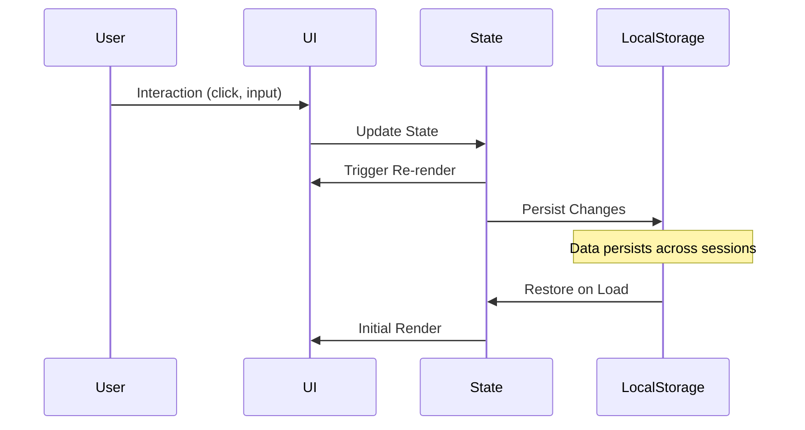
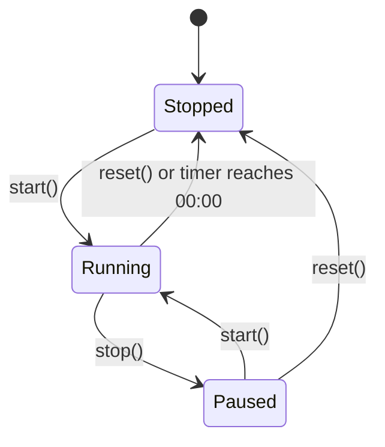

# Design Document: To-Do List Life Dashboard

## Overview

The To-Do List Life Dashboard is a single-page client-side web application that combines multiple productivity features into one unified interface. The application architecture follows a component-based approach where each feature (Greeting Module, Focus Timer, Task Management, Quick Links) operates as an independent module with its own state management and DOM manipulation logic.

The application runs entirely in the browser with no backend dependencies. All state persistence is handled through the browser's Local Storage API, making the application portable and privacy-friendly. The architecture emphasizes:

- **Separation of concerns**: Each feature module is self-contained
- **State-driven UI**: DOM updates are driven by state changes
- **Event-driven interactions**: User actions trigger state changes which cascade to UI updates
- **Data persistence**: All user data automatically saves to Local Storage

The application uses vanilla JavaScript (ES6+), HTML5 semantic markup, and CSS3 for styling, ensuring broad browser compatibility and minimal dependencies.

## Architecture

### System Structure



### Component Architecture

Each feature module follows a consistent pattern:

1. **State**: JavaScript object holding the current state
2. **Initialization**: Function to set up initial state and event listeners
3. **State Updaters**: Functions that modify state and trigger UI updates
4. **Renderers**: Functions that update the DOM based on current state
5. **Persistence**: Functions to save/load state from Local Storage

### Data Flow



## Components and Interfaces

### 1. Greeting Module

**Responsibility**: Display current time, date, and time-based greeting

**State Structure**:
```javascript
{
  currentTime: Date,
  formattedTime: String,
  formattedDate: String,
  greeting: String
}
```

**Public Interface**:
- `initGreeting()`: Initialize the module and start the update interval
- `updateTimeAndGreeting()`: Update time, date, and greeting based on current system time
- `formatTime(date)`: Convert Date object to "HH:MM:SS AM/PM" format
- `formatDate(date)`: Convert Date object to "DayOfWeek, Month DD, YYYY" format
- `getGreeting(hour)`: Return appropriate greeting based on hour (0-23)

**DOM Elements**:
- `#time-display`: Shows formatted time
- `#date-display`: Shows formatted date
- `#greeting-display`: Shows contextual greeting

### 2. Focus Timer

**Responsibility**: Provide a countdown timer for focused work sessions

**State Structure**:
```javascript
{
  totalSeconds: Number,      // Initial duration (1500)
  remainingSeconds: Number,  // Current countdown value
  state: String,             // "stopped" | "running" | "paused"
  intervalId: Number | null  // Reference to setInterval
}
```

**Public Interface**:
- `initTimer()`: Initialize timer with default values and attach event listeners
- `startTimer()`: Begin or resume countdown
- `stopTimer()`: Pause countdown at current value
- `resetTimer()`: Reset to initial duration and stop
- `tick()`: Decrement remainingSeconds and update display
- `formatTimerDisplay(seconds)`: Convert seconds to "MM:SS" format

**DOM Elements**:
- `#timer-display`: Shows remaining time in MM:SS format
- `#start-button`: Triggers start/resume
- `#stop-button`: Triggers pause
- `#reset-button`: Triggers reset

**State Transitions**:


### 3. Task Manager

**Responsibility**: CRUD operations for to-do list items with persistence

**State Structure**:
```javascript
{
  tasks: Array<{
    id: String,           // Unique identifier (timestamp + random)
    description: String,  // Task text (1-500 chars)
    completed: Boolean,   // Completion status
    editing: Boolean      // UI edit mode flag
  }>
}
```

**Public Interface**:
- `initTaskManager()`: Load tasks from Local Storage and render, attach event listeners
- `addTask(description)`: Create new task and persist
- `editTask(id)`: Enter edit mode for task
- `saveTask(id, newDescription)`: Save edited description
- `cancelEdit(id)`: Exit edit mode without saving
- `toggleTaskCompletion(id)`: Toggle completed status
- `deleteTask(id)`: Remove task from list
- `renderTasks()`: Update task list UI based on current state
- `persistTasks()`: Save tasks to Local Storage
- `loadTasks()`: Retrieve tasks from Local Storage
- `validateTaskDescription(description)`: Validate 1-500 character constraint

**DOM Elements**:
- `#task-input`: Input field for new task description
- `#add-task-button`: Submit new task
- `#task-list`: Container for task items
- `.task-item`: Individual task element (dynamically generated)

**Local Storage Key**: `dashboard_tasks`

### 4. Quick Links Manager

**Responsibility**: Save and display favorite website shortcuts

**State Structure**:
```javascript
{
  quickLinks: Array<{
    id: String,     // Unique identifier
    name: String,   // Display name (1-50 chars)
    url: String     // Valid URL starting with http:// or https://
  }>,
  maxLinks: Number  // Maximum allowed (20)
}
```

**Public Interface**:
- `initQuickLinks()`: Load links from Local Storage and render, attach event listeners
- `addQuickLink(name, url)`: Create new quick link and persist
- `deleteQuickLink(id)`: Remove quick link from list
- `renderQuickLinks()`: Update quick links UI based on current state
- `persistQuickLinks()`: Save links to Local Storage
- `loadQuickLinks()`: Retrieve links from Local Storage
- `validateQuickLink(name, url)`: Validate name length and URL format
- `isAtMaxCapacity()`: Check if 20 links limit reached

**DOM Elements**:
- `#link-name-input`: Input for website name
- `#link-url-input`: Input for URL
- `#add-link-button`: Submit new link
- `#quick-links-container`: Container for link buttons
- `.quick-link-button`: Individual link button (dynamically generated)

**Local Storage Key**: `dashboard_quicklinks`

## Data Models

### Task Object
```javascript
{
  id: String,           // Format: timestamp-random (e.g., "1625347200000-abc123")
  description: String,  // Task text, 1-500 characters
  completed: Boolean    // false = active, true = completed with strikethrough
}
```

**Validation Rules**:
- `id`: Must be unique within the tasks array
- `description`: Required, must be non-empty after trimming, max 500 characters
- `completed`: Boolean, defaults to false

### Quick Link Object
```javascript
{
  id: String,     // Format: timestamp-random (e.g., "1625347200000-xyz789")
  name: String,   // Display name, 1-50 characters
  url: String     // Full URL starting with "http://" or "https://"
}
```

**Validation Rules**:
- `id`: Must be unique within the quickLinks array
- `name`: Required, must be non-empty after trimming, 1-50 characters
- `url`: Required, must match regex: `^https?:\/\/.+`
- Array length: Maximum 20 quick links allowed

### Timer State Object
```javascript
{
  totalSeconds: 1500,        // Constant: 25 minutes
  remainingSeconds: Number,  // 0 to 1500
  state: String,             // "stopped" | "running" | "paused"
  intervalId: Number | null  // Reference to active setInterval, null when stopped/paused
}
```

### Local Storage Schema

**Key: `dashboard_tasks`**
```json
[
  {
    "id": "1625347200000-abc123",
    "description": "Complete project documentation",
    "completed": false
  },
  {
    "id": "1625347201000-def456",
    "description": "Review pull requests",
    "completed": true
  }
]
```

**Key: `dashboard_quicklinks`**
```json
[
  {
    "id": "1625347200000-xyz789",
    "name": "GitHub",
    "url": "https://github.com"
  },
  {
    "id": "1625347201000-lmn012",
    "name": "Stack Overflow",
    "url": "https://stackoverflow.com"
  }
]
```

**Error Handling for Local Storage**:
- Malformed JSON: Parse errors trigger console warning and initialize with empty array
- Missing keys: Return empty array
- Invalid structure: Validate array structure, filter out invalid objects
- Quota exceeded: Display error message to user, continue operation without persistence


## Correctness Properties

*A property is a characteristic or behavior that should hold true across all valid executions of a system—essentially, a formal statement about what the system should do. Properties serve as the bridge between human-readable specifications and machine-verifiable correctness guarantees.*

### Property 1: Time Format Correctness

*For any* valid Date object, the formatted time string SHALL match the pattern "HH:MM:SS AM/PM" where HH is zero-padded 01-12, MM and SS are zero-padded 00-59, and AM/PM is separated by a space.

**Validates: Requirements 1.1**

### Property 2: Date Format Correctness

*For any* valid Date object, the formatted date string SHALL match the pattern "DayOfWeek, Month DD, YYYY" where DayOfWeek is the full weekday name, Month is the full month name, DD is zero-padded, and YYYY is the four-digit year.

**Validates: Requirements 1.2**

### Property 3: Greeting Correctness by Hour

*For any* hour value from 0 to 23, the greeting function SHALL return:
- "Good morning" for hours 5-11
- "Good afternoon" for hours 12-16
- "Good evening" for hours 17-20
- "Good night" for hours 21-23 and 0-4

**Validates: Requirements 1.3, 1.4, 1.5, 1.6**

### Property 4: Timer Format Correctness

*For any* non-negative integer seconds value from 0 to 1500, the formatted timer string SHALL match the pattern "MM:SS" where MM is zero-padded minutes (00-25) and SS is zero-padded seconds (00-59).

**Validates: Requirements 2.6**

### Property 5: Timer State Machine Validity

*For any* sequence of valid timer operations (start, stop, reset), the timer state SHALL always remain in one of three valid states (stopped, running, paused), SHALL only transition according to valid state machine rules, and SHALL ignore operations that would create invalid transitions.

**Validates: Requirements 2.2, 2.3, 2.4, 2.8, 2.9**

### Property 6: Task Description Validation

*For any* string input, the task validation function SHALL accept non-empty strings with 1-500 characters after trimming, and SHALL reject empty strings, whitespace-only strings, and strings exceeding 500 characters.

**Validates: Requirements 3.1, 3.10**

### Property 7: Task Completion Toggle Idempotence

*For any* task with a completion status, toggling the completion status twice SHALL return the task to its original completion state.

**Validates: Requirements 3.5, 3.6**

### Property 8: Task Addition Increases List Length

*For any* task list and any valid task description, adding a task SHALL increase the task list length by exactly one and the new task SHALL appear in the list with the provided description, a unique ID, and completed status of false.

**Validates: Requirements 3.1**

### Property 9: Task Deletion Decreases List Length

*For any* non-empty task list, deleting an existing task SHALL decrease the task list length by exactly one and the deleted task SHALL no longer appear in the list.

**Validates: Requirements 3.7**

### Property 10: Task Edit Preservation

*For any* task being edited, if the edit is saved with a valid new description, the task SHALL retain its original ID and completion status while updating only the description field.

**Validates: Requirements 3.2, 3.3**

### Property 11: Quick Link Validation

*For any* name and URL inputs, the Quick Link validation SHALL accept names with 1-50 characters after trimming and URLs starting with "http://" or "https://", and SHALL reject empty names, names exceeding 50 characters, empty URLs, or URLs with invalid protocols.

**Validates: Requirements 4.1, 4.6**

### Property 12: Quick Link Deletion Decreases List Length

*For any* non-empty Quick Links list, deleting an existing Quick Link SHALL decrease the list length by exactly one and the deleted link SHALL no longer appear in the list.

**Validates: Requirements 4.3**

### Property 13: Task Serialization Round-Trip

*For any* valid array of task objects, serializing to JSON and then deserializing SHALL produce an array with equivalent task objects preserving all id, description, and completed properties.

**Validates: Requirements 5.1, 5.3**

### Property 14: Quick Link Serialization Round-Trip

*For any* valid array of Quick Link objects, serializing to JSON and then deserializing SHALL produce an array with equivalent Quick Link objects preserving all id, name, and url properties.

**Validates: Requirements 5.2, 5.4**

### Property 15: Maximum Quick Links Capacity Enforcement

*For any* Quick Links list, if the list contains exactly 20 links, attempting to add another link SHALL be rejected and the list length SHALL remain at 20.

**Validates: Requirements 4.7**


## Error Handling

### Invalid Date Objects

**Scenario**: System time is unavailable or Date object is invalid

**Handling**:
- Display fallback text: "-- : -- : -- --" for time
- Display fallback text: "Date unavailable" for date
- Log warning to console: `console.warn('Invalid date object detected')`
- Continue normal operation for other modules

**User Experience**: User sees placeholder text but can continue using timer, tasks, and quick links

### Local Storage Failures

**Scenario 1**: Local Storage read returns null or undefined (first visit or cleared storage)

**Handling**:
- Initialize with empty arrays for tasks and quick links
- No error message shown (expected behavior)
- Continue normal operation

**Scenario 2**: Local Storage read contains malformed JSON

**Handling**:
- Catch JSON.parse() exception
- Log warning to console: `console.warn('Failed to parse stored data', error)`
- Initialize with empty arrays
- No user-facing error (graceful degradation)

**Scenario 3**: Local Storage write fails (quota exceeded, privacy mode, browser restrictions)

**Handling**:
- Catch storage exception (QuotaExceededError, SecurityError)
- Display error message to user: "Unable to save data. Storage may be full or disabled."
- Continue operation without persistence
- Allow user to continue working (changes won't persist)
- Log error to console for debugging

### Validation Failures

**Scenario 1**: Invalid task description (empty, whitespace-only, or >500 characters)

**Handling**:
- Prevent task creation
- Display inline error message near input field
- Message text:
  - Empty/whitespace: "Task description cannot be empty"
  - Too long: "Task description cannot exceed 500 characters"
- Clear error message when user modifies input
- Keep input field value so user can correct it

**Scenario 2**: Invalid Quick Link (empty name, invalid URL, or name >50 characters)

**Handling**:
- Prevent link creation
- Display inline error message near input fields
- Message text:
  - Empty name: "Website name cannot be empty"
  - Name too long: "Website name cannot exceed 50 characters"
  - Empty URL: "URL cannot be empty"
  - Invalid protocol: "URL must start with http:// or https://"
- Clear error message when user modifies input

**Scenario 3**: Quick Links at maximum capacity (20 links)

**Handling**:
- Prevent link creation
- Display error message: "Maximum of 20 quick links reached. Delete a link to add a new one."
- Disable add button visually when at capacity
- Re-enable add button when a link is deleted

### Timer Boundary Conditions

**Scenario**: Timer reaches 00:00

**Handling**:
- Stop the interval (clearInterval)
- Set state to "stopped"
- Display "00:00"
- Optional: Play browser notification sound
- Reset to 25:00 on next reset button click

### Browser Compatibility Issues

**Scenario**: Browser does not support required APIs (Local Storage, Date, setInterval)

**Handling**:
- Feature detection at initialization
- If Local Storage unavailable:
  - Display warning: "Your browser does not support data persistence. Changes will not be saved."
  - Allow app to function without persistence
- If other APIs unavailable:
  - Gracefully degrade feature
  - Display appropriate error message

### DOM Manipulation Errors

**Scenario**: Expected DOM elements are missing (incorrect HTML structure)

**Handling**:
- Check for element existence before attaching event listeners
- Log error to console if critical element missing: `console.error('Required element not found:', elementId)`
- Prevent JavaScript errors from breaking other modules
- Use optional chaining and null checks

## Testing Strategy

### Overview

The testing approach combines **property-based testing** for core logic and **example-based unit tests** for specific scenarios and edge cases, supplemented with **integration tests** for browser API interactions and **cross-browser compatibility tests**.

### Property-Based Testing

Property-based testing will verify universal correctness properties across randomly generated inputs, ensuring the system behaves correctly for the full input space rather than just handpicked examples.

**Library**: `fast-check` (JavaScript property-based testing library)

**Configuration**:
- Minimum 100 iterations per property test
- Each test must reference its design document property using the tag format below

**Test Tag Format**:
```javascript
// Feature: todo-list-life-dashboard, Property 1: Time Format Correctness
```

#### Property Test Coverage

**Property 1: Time Format Correctness**
- Generator: Random Date objects (valid range: year 1970-2099)
- Assertion: Output matches regex `^(0[1-9]|1[0-2]):[0-5][0-9]:[0-5][0-9] (AM|PM)$`
- Assertion: Parsed hour value matches expected 12-hour format conversion

**Property 2: Date Format Correctness**
- Generator: Random Date objects (valid range: year 1970-2099)
- Assertion: Output matches expected pattern with valid day/month names
- Assertion: Day, month, year values can be extracted and match input Date

**Property 3: Greeting Correctness by Hour**
- Generator: Random integer 0-23
- Assertion: Output matches expected greeting for input hour range

**Property 4: Timer Format Correctness**
- Generator: Random integer 0-1500
- Assertion: Output matches regex `^[0-2][0-9]:[0-5][0-9]$`
- Assertion: Parsed minutes and seconds match expected values

**Property 5: Timer State Machine Validity**
- Generator: Random sequence of operations (start, stop, reset)
- Assertion: State always in {stopped, running, paused}
- Assertion: Invalid transitions are ignored (e.g., start when running)
- Assertion: Valid transitions update state correctly

**Property 6: Task Description Validation**
- Generator: Random strings (empty, whitespace, valid 1-500, invalid >500)
- Assertion: Valid strings accepted, invalid strings rejected
- Assertion: Rejection reason matches input type

**Property 7: Task Completion Toggle Idempotence**
- Generator: Random task with random completion status
- Assertion: toggle(toggle(task)) === task

**Property 8: Task Addition Increases List Length**
- Generator: Random task list + random valid description
- Assertion: New list length = old length + 1
- Assertion: New task appears in list with correct properties

**Property 9: Task Deletion Decreases List Length**
- Generator: Random non-empty task list + random task ID from list
- Assertion: New list length = old length - 1
- Assertion: Deleted task ID not in new list

**Property 10: Task Edit Preservation**
- Generator: Random task + random valid new description
- Assertion: Edited task has same ID and completion status
- Assertion: Description updated to new value

**Property 11: Quick Link Validation**
- Generator: Random name strings + random URL strings
- Assertion: Valid combinations accepted
- Assertion: Invalid combinations rejected with correct reason

**Property 12: Quick Link Deletion Decreases List Length**
- Generator: Random non-empty Quick Links list + random link ID
- Assertion: New list length = old length - 1
- Assertion: Deleted link ID not in new list

**Property 13: Task Serialization Round-Trip**
- Generator: Random array of valid task objects
- Assertion: JSON.parse(JSON.stringify(tasks)) deep equals tasks

**Property 14: Quick Link Serialization Round-Trip**
- Generator: Random array of valid Quick Link objects
- Assertion: JSON.parse(JSON.stringify(links)) deep equals links

**Property 15: Maximum Quick Links Capacity Enforcement**
- Generator: Array of exactly 20 Quick Links + random new link
- Assertion: Add operation rejected
- Assertion: List length remains 20

### Unit Testing

Unit tests will cover specific examples, edge cases, and error conditions not fully covered by property tests.

**Framework**: Jest or Vitest (JavaScript testing frameworks)

**Test Coverage**:

**Greeting Module**:
- Invalid Date object handling (explicit test with `new Date('invalid')`)
- Midnight boundary (23:59:59 → 00:00:00 transition)
- Noon boundary (11:59:59 → 12:00:00 transition)

**Focus Timer**:
- Initial state verification (1500 seconds, stopped state)
- Timer completion (reaches 00:00)
- Multiple reset operations
- Rapid start/stop clicking (debouncing)

**Task Manager**:
- Empty task list initialization
- Edit mode cancellation (discard changes)
- Delete last remaining task
- XSS prevention (task description with HTML/script tags)

**Quick Links**:
- Empty links list initialization
- Maximum capacity boundary (19→20→attempt 21)
- URL with special characters (query params, fragments)
- XSS prevention (name and URL with HTML/script tags)

**Local Storage**:
- First-time user (no stored data)
- Malformed JSON strings
- Non-array values in storage
- Objects missing required properties
- Storage quota exceeded simulation

### Integration Testing

Integration tests will verify interaction with browser APIs and DOM manipulation.

**Test Coverage**:

**DOM Interactions**:
- Task list rendering after add/edit/delete
- Quick Links rendering after add/delete
- Timer display updates during countdown
- Button state changes (disabled/enabled)
- Error message display and clearing

**Local Storage Integration**:
- Write tasks to Local Storage
- Read tasks from Local Storage
- Write Quick Links to Local Storage
- Read Quick Links from Local Storage
- Handle storage events (data changed in another tab)

**Timing and Performance**:
- Time updates every 1000ms
- Timer countdown every 1000ms
- UI updates within 100ms of user action
- Page load within 2 seconds

**Browser APIs**:
- Date object usage
- setInterval/clearInterval
- Local Storage API
- DOM manipulation (createElement, appendChild, remove)

### Cross-Browser Testing

**Target Browsers**:
- Chrome 90+
- Firefox 88+
- Edge 90+
- Safari 14+

**Testing Approach**:
- Automated tests run in all target browsers using Playwright or Selenium
- Manual exploratory testing for visual consistency
- Feature detection for browser-specific behavior

**Test Scenarios**:
- All features functional in each browser
- Consistent visual appearance
- Local Storage works correctly
- No console errors or warnings

### Test Execution Plan

1. **Development Phase**:
   - Run property-based tests on every code change (minimum 100 iterations per property)
   - Run unit tests on every code change
   - Use watch mode for rapid feedback

2. **Pre-Commit Phase**:
   - Run full test suite (property + unit tests)
   - Require 100% pass rate
   - Run linter and code formatter

3. **Continuous Integration**:
   - Run property tests with 1000 iterations for deeper coverage
   - Run integration tests against all target browsers
   - Generate code coverage report (target: >90% for logic modules)

4. **Release Phase**:
   - Manual cross-browser testing
   - Performance testing (page load, responsiveness)
   - Accessibility testing (keyboard navigation, screen reader)

### Test Organization

**Directory Structure**:
```
tests/
├── property/
│   ├── greeting.property.test.js
│   ├── timer.property.test.js
│   ├── tasks.property.test.js
│   ├── quicklinks.property.test.js
│   └── storage.property.test.js
├── unit/
│   ├── greeting.test.js
│   ├── timer.test.js
│   ├── tasks.test.js
│   ├── quicklinks.test.js
│   └── storage.test.js
├── integration/
│   ├── dom.test.js
│   ├── storage-integration.test.js
│   └── timing.test.js
└── e2e/
    └── dashboard.spec.js
```

### Success Criteria

- All 15 property-based tests pass with 100+ iterations
- All unit tests pass
- All integration tests pass
- Code coverage >90% for logic modules (excluding DOM manipulation)
- No console errors in any target browser
- Page load time <2 seconds on standard broadband connection
- UI responds to interactions within 100ms

